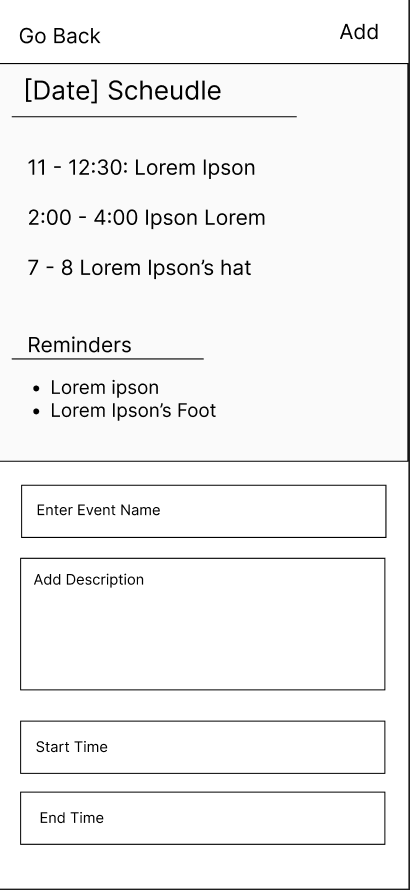

# User Experience Design

This repository contains instructions and files for two assignments that together comprise the user experience design phase of a web app.

Replace the contents of this file with the completed assignments, as described in:

- [app map & wireframe instructions](instructions-0a-app-map-wireframes.md).
- [prototype instructions](instructions-0b-prototyping.md)

# App Map 

The app map depicts major pages that users can access. It demonstrates the parent/child relation of each page. 

# Sign In / Login 

# Homepage (Personal Calendar) 

The homepage will be the user's personal calendar, where they can view their upcoming schedules.

# Adding events to Personal Calendar 

When a user decides to add a new event on their personal calendar they will tap a date on the calendar on the hopepage, and then be shown the schedule of the day with the bottom portion being any new event they want to add. 

# User Profile 

- The Profile page shows a User's profile information, as well as allowing them to navigate to their Account Settings or Add External Calendars to their profile.

- This page is a navbar item, and will be always be accessible from the HomePage and any of the HomePages first children, see AppMap for more details.

# Look Up Profile 

- The Look Up page allows a user to look for users and groups. For the users and groups, one can either view their public profile, or request to add friend or join group.

- This page is a navbar item, and will be always be accessible from the HomePage and any of the HomePages first children, see AppMap for more details.

# Friends 

- The Friends page shows a users friend list, allowing them to quickly find out who they are connected to and view their friends private profile.

- This page is a navbar item, and will be always be accessible from the HomePage and any of the HomePages first children, see AppMap for more details.
# Groups

- The Groups page shows a users group list, allowing them to quickly find out which groups they are in and to and view their group private profile. 

- The Groups page also contains a 'Create Group' button allowing them to navigate to the Create Groups page easily. 

- This page is a navbar item, and will be always be accessible from the HomePage and any of the HomePages first children, see AppMap for more details.

# Events

- The Events page shows a list of all public events, allowing a user to either view detailed event information, or request to join event.

- The Events page also contains a 'Create Event' button allowing them to navigate to the Create Events page easily.

- This page is a navbar item, and will be always be accessible from the HomePage and any of the HomePages first children, see AppMap for more details.

- This information page displays the full information for a single event, and can be navigated to only from the events feed page. 

- A user can either go back to the main events page, or if interested after viewing all relevant information, can request to join event.

